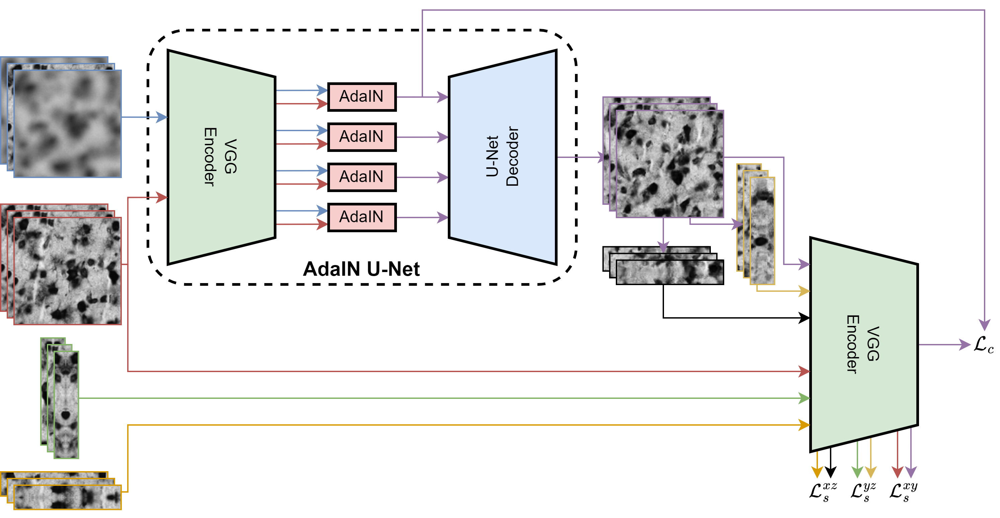
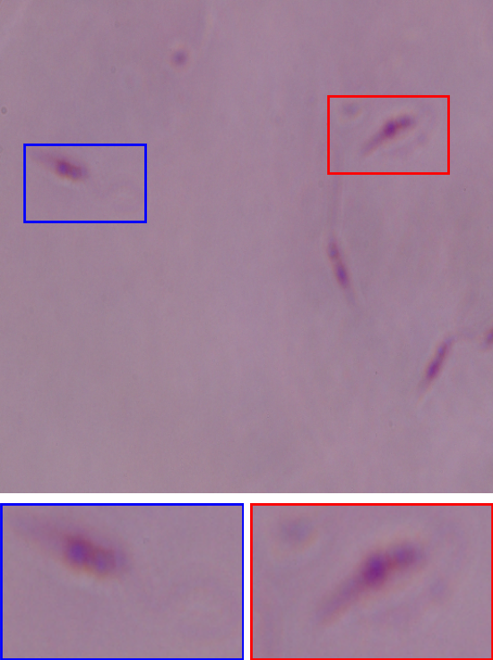
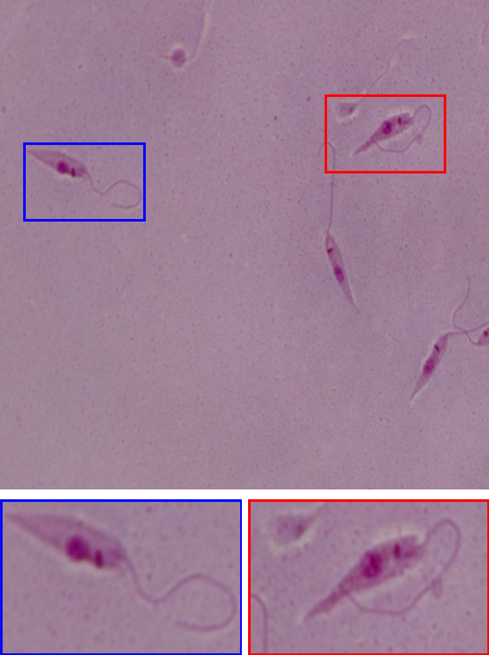
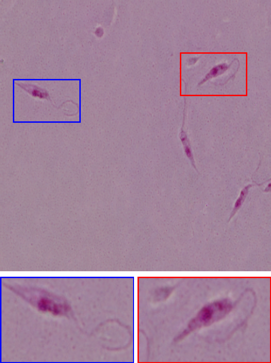
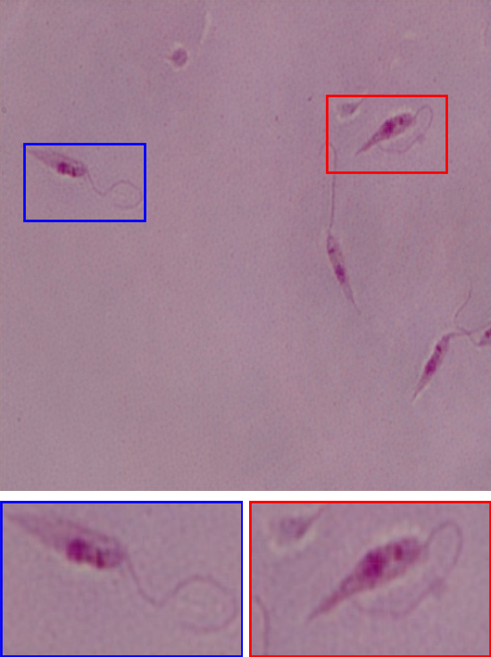

<div align="center">

# Visual Enhancement of Whole Brain Slide Images from Z-Scanning Microscopes with Deep Style Learning
# Z-Stack-Enhancement pipeline

<a href="https://pytorch.org/get-started/locally/"></a>
<a href="https://pytorchlightning.ai/"></a>
<a href="https://hydra.cc/"></a>
<a href="https://github.com/HelmholtzAI-Consultants-Munich/ML-Pipeline-Template"></a>
<a href="https://github.com/pyscaffold/pyscaffoldext-dsproject"></a>

</div>

# Description

This repository contains the code in PyTorch (PyTorch Lightning) for the master thesis: 

**Visual Enhancement of Whole Brain Slide Images from Z-Scanning Microscopes with Deep Style Learning**




The master thesis presents the **Z-Stack Enhancement (ZSE)** pipeline, a framework for improving the visual quality and reducing blurring of z-stack brain images from whole slide microscopy scanners. The pipeline consists of two stages: first, we locate the edges and estimate the thickness of brain tissue in z-stacks, then we use the novel AdaIN U-Net, a deep style learning based framework, to deblur and enhance the visual quality of microscopic images. Our deep style learning based method is trained on a large dataset of microscopic images to transfer the style of a selected in-focus reference image to out-of-focus microscopic images, resulting in improved visual appearance and aiding researchers in identifying individual cells and other structures. We also propose two 3D loss functions for z-stacks. 

We evaluate performance on two microscopic image datasets: (i) a 2D dataset of Leishmania parasites containing pairs of in-focus and out-of-focus images, and (ii) a super-high-resolution 3D dataset of brain image stacks from scans of brain B21 at Research Center Jülich.

On the Leishmania parasite dataset, our experiments show that the AdaIN U-Net performs comparably to state-of-the-art deblurring methods while requiring fewer trainable parameters and training time than the state-of-the-art [Correction of Out-of-focus Microscopic Images (COMI)](https://github.com/jiangdat/COMI) method. Additionally, our model shows significant improvement in generalization performance on Leishmania parasite images captured with different microscope apparatuses and blur types compared to COMI.

Our experiments on the brain B21 z-stack dataset show that the ZSE pipeline improves the appearance of z-stacks by removing three types of blur we observed in the brain z-stacks: (i) horizontal images that are farther away from the optimal focal plane (the center of the z-stack) becoming increasingly blurry, (ii) horizontal images very close to the top and bottom of the z-stack appear blurriest, due to the scanner not scanning tissue anymore, and (iii) cells cast shadows mostly in vertical direction of the cross-sections. AdaIN U-Net models trained with our 3D loss functions generate realistic z-stacks, while our model trained with the 2D loss function is more accurate in terms of cell structure distribution. The trained AdaIN U-Nets demonstrate excellent generalization capabilities for deblurring and visual enhancement across different brains and cell stainings, and are able to transfer style between modalities. 

# Leishmania results

|                  Blurry source image                   |               Ground truth sharp image                | AdaIN U-Net (Gram)                                              | COMI                                                 |
|:------------------------------------------------------:|:-----------------------------------------------------:|-----------------------------------------------------------------|------------------------------------------------------|
|  |  |  |  |

# Trained model checkpoints

The checkpoints of the models used in the thesis can be found at:
```
https://uni-duesseldorf.sciebo.de/s/PcEIucWCdkxMbjg
```

# Quickstart

## Create the project environment and install the zse package

### Install the CONDA environment with the necessary requirements:

1. Make sure to deactivate all other virtual environments, e.g. run
```bash
conda deactivate
```

2. Setup and activate dl environment: 
```bash
conda env create -f environment/environment.yml
```

3. To activate the environment run
```bash
conda activate dl
```

4. To deactivate the environment run
```
deactivate
```

Checkout `environment/README.md` for more info (e.g. on how to create a Jupyter kernel).
`

### Install the zse package

Before using the project, one needs to install the package:
```bash
pip install -e .
```


## How to train a model:
Example of training the AdaIN U-Net on the Leishmania dataset. To run the training pipeline, simply run:
```bash
python scripts/train.py experiment=leishmania_adain_unet
```
Or, if you want to submit the training job to a  cluster node via slurm, run:
```bash
sbatch scripts/train_leishmania_adain_unet.sbatch
```
> * The experiments, evaluations, etc., are stored under the `logs` directory.
> * The default experiments tracking system is tensorboard. The `tensorboard` directory is contained in `logs`. To view a user friendly view of the experiments, run:
> ```bash
> # make sure you are inside logs (where mlruns is located)
> tensorboard --logdir logs/tensorboard/
> ```
> * To access the logs with tensorboard from the JSC filesystem you could either use [SSH tunneling](https://help.ubuntu.com/community/SSH/OpenSSH/PortForwarding) or as [sshfs](https://wiki.ubuntuusers.de/FUSE/sshfs/) mount
> * When evaluating (running `test.py`), make sure you give the correct checkpoint path in `configs/test.yaml`


## How to use a trained model for inference:
Minimal example showing how to use the model on brain dataset:
```python
from torch.utils.data import DataLoader
from torchvision import models, transforms
from zse.datamodules.components.brain_datasets import ZStackDataset3D
from zse.models.adain_module import AdaINLitModule2D
from zse.models.components.adain_unet import AdaINUNet

data_test = ZStackDataset3D(f"/p/fastdata/bigbrains/personal/crijnen1/data/bigbrain_1micron/20/test/blurry/*.hdf5", transform=transforms.ToTensor())
loader = DataLoader(data_test, batch_size=1, num_workers=1)

vgg19 = models.vgg19(pretrained=True)
norm = transforms.Normalize(mean=[0.485, 0.456, 0.406], std=[0.229, 0.224, 0.225])
adain_unet_backbone = AdaINUNet(vgg19, norm)
module = AdaINLitModule2D.load_from_checkpoint("models/brain/adain_unet_3ds_best.ckpt", net=adain_unet_backbone)
module.freeze()
module.eval()

test_batch = next(iter(loader))
out = module(test_batch)
```


# Project Organization
```
├── configs                              <- Hydra configuration files
│   ├── callbacks                               <- Callbacks configs
│   ├── datamodule                              <- Datamodule configs
│   ├── debug                                   <- Debugging configs
│   ├── experiment                              <- Experiment configs
│   ├── hparams_search                          <- Hyperparameter search configs
│   ├── local                                   <- Local configs
│   ├── log_dir                                 <- Logging directory configs
│   ├── logger                                  <- Logger configs
│   ├── model                                   <- Model configs
│   ├── trainer                                 <- Trainer configs
│   │
│   ├── test.yaml                               <- Main config for testing
│   └── train.yaml                              <- Main config for training
│
├── data                                 <- Project data
│
├── docs                                 <- Directory for Sphinx documentation in rst or md
│
├── environment                          <- Computing environment
│   └── environment.yml                         <- Conda environment file
│
├── logs
│   ├── experiments                      <- Logs from experiments
│   ├── slurm                            <- Slurm outputs and errors
│   └── tensorboard                      <- Training monitoring logs
|
├── models                               <- Trained and serialized models, model predictions
|
├── notebooks                            <- Jupyter notebooks containing all experiments conducted in the thesis
|
├── reports                              <- Generated figures for the thesis
|
├── scripts                              <- Scripts used in project
│   ├── test.py                                 <- Run testing
│   └── train.py                                <- Run training
│
├── src/zse                              <- Source code
│   ├── datamodules                             <- Lightning datamodules
│   ├── models                                  <- Lightning models
│   ├── style_transfer                          <- Neural Style Transfer in PyTorch
│   ├── utils                                   <- Utility scripts
│   │
│   ├── testing_pipeline.py
│   └── training_pipeline.py
│
├── tests                                <- Tests of any kind
│   ├── helpers                                 <- A couple of testing utilities
│   ├── shell                                   <- Shell/command based tests
│   └── unit                                    <- Unit tests
│
├── .coveragerc                          <- Configuration for coverage reports of unit tests.
├── .gitignore                           <- List of files/folders ignored by git
├── .pre-commit-config.yaml              <- Configuration of pre-commit hooks for code formatting
├── setup.cfg                            <- Configuration of linters and pytest
├── LICENSE.txt                          <- License as chosen on the command-line
├── pyproject.toml                       <- Build configuration. Don't change! Use `pip install -e .`
│                                           to install for development or to build `tox -e build`
├── setup.cfg                            <- Declarative configuration of your project.
├── setup.py                             <- [DEPRECATED] Use `python setup.py develop` to install for
│                                           development or `python setup.py bdist_wheel` to build
└── README.md
```
